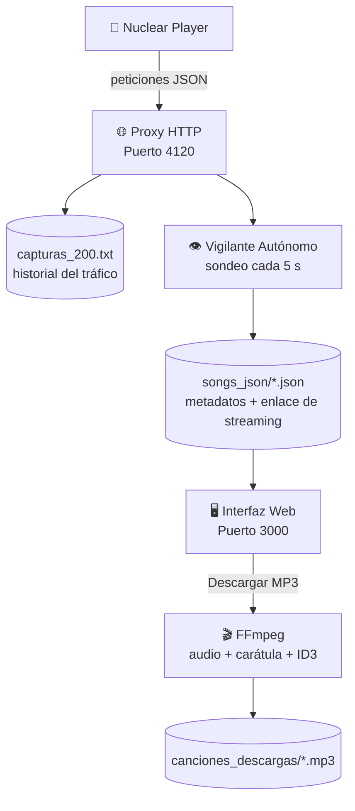

# ☢️ Nuclear-DW

### Gestor y proxy de descargas MCP para el reproductor **Nuclear** en Windows 10


> **Escucha música en Nuclear y llévatela en MP3 con carátula y etiquetas ID3, con un solo clic.**

---

## 📑 Contenido

1. [Descripción general](#-descripción-general)
2. [Requisitos previos](#️-requisitos-previos-en-windows-10)
3. [Estructura del proyecto](#-estructura-del-proyecto)
4. [Instalación del plugin para Nuclear](#-instalación-del-plugin-para-nuclear)
5. [Ejecución del sistema](#️-ejecución-del-sistema-en-windows-10)
6. [Uso diario](#-uso-diario)
7. [Notas importantes](#️-notas-importantes-para-windows-10)
8. [Solución de problemas](#-solución-de-problemas)
9. [Aviso legal y autoría](#-aviso-legal-y-autoría)

---

## 📖 Descripción general

**Nuclear-DW** es un sistema integral diseñado para el reproductor musical **Nuclear** en **Windows 10**. Captura lo que escuchas y te permite convertirlo en archivos MP3 con carátula y metadatos. Se compone de tres módulos:

| Módulo | Puerto | Función |
|:--|:--:|:--|
| 🌐 **Servidor Proxy HTTP** | `4120` | Intercepta y monitorea en segundo plano las peticiones del reproductor y del sistema MCP. |
| 👁️ **Vigilante Autónomo** | — | Detecta automáticamente los cambios de canción, extrae metadatos y enlaces de streaming *en el aire* y los guarda en archivos **JSON** estructurados (sondeo cada **5 s**). |
| 🖥️ **Servidor Web Gráfico** | `3000` | Interfaz en **Modo Oscuro** que muestra las canciones capturadas en tarjetas y permite descargarlas en **MP3**, uniendo audio, carátula y metadatos. |

### 🔄 Flujo de trabajo



### ✨ Características

- ✅ Intercepción de peticiones JSON en segundo plano.
- ✅ Detección automática de cambios de canción, incluso cuando Nuclear pasa silenciosamente del videoclip al **«Audio Oficial»**.
- ✅ Interfaz web en **Modo Oscuro** con una tarjeta por canción.
- ✅ MP3 final con **carátula incrustada** y **etiquetas ID3** correctas.
- ✅ Usa únicamente **módulos nativos de Node.js**: no requiere `npm install`.

---

## ⚙️ Requisitos previos en Windows 10

Para que la "magia" de descargar e incrustar carátulas funcione, necesitas tener instaladas estas dos herramientas:

| Herramienta | Para qué sirve | Dónde obtenerla |
|:--|:--|:--|
| **Node.js** | Ejecutar el servidor | [nodejs.org](https://nodejs.org/) |
| **FFmpeg** | Crear el MP3 con carátula y etiquetas | Se instala con `winget` (ver abajo) |

### 🛠️ ¿Cómo instalar FFmpeg en Windows 10?

1. Abre **PowerShell como Administrador**: clic derecho en el botón de Inicio y elige **«Windows PowerShell (Administrador)»**.
2. Ejecuta el siguiente comando:

   ```powershell
   winget install ffmpeg
   ```

3. Si te pide aceptar términos o reiniciar la terminal, hazlo: así FFmpeg queda agregado automáticamente a las variables de entorno **PATH** de Windows 10.
4. Verifica que todo quedó listo en una terminal nueva:

   ```cmd
   node -v
   ffmpeg -version
   ```

> [!TIP]
> Si `winget` no encuentra el paquete con ese nombre, prueba con el identificador completo: `winget install Gyan.FFmpeg`

---

## 📁 Estructura del proyecto

Al ejecutar el script por primera vez, el programa crea automáticamente su entorno de trabajo dentro de tu carpeta:

```text
Tu-Carpeta-Del-Proyecto/
├── server.js               # Script principal: Proxy + Servidor Web
├── capturas_200.txt        # Historial (logs) de todo el tráfico JSON capturado
├── songs_json/             # 📂 Se genera solo: los JSON de cada canción
└── canciones_descargas/    # 📂 Se genera solo: tus MP3 listos
```

---

## 🔌 Instalación del plugin para Nuclear

Si vas a cargar el visualizador MCP dentro del propio Nuclear, crea una **carpeta dedicada** para el plugin (por ejemplo, en Documentos o en el Escritorio) con esta estructura:

```text
Nuclear-DW-Plugin/
├── package.json
└── plugin.js

```

### 1️⃣ Archivo `package.json`

Define la información del plugin y vincula tu imagen local mediante `icon.link`.

```json
{
  "name": "Nuclear-DW",
  "version": "0.1.0",
  "description": "Interceptación de peticiones de logs de MCP y envío a un servidor externo. (descargar canciones)",
  "author": "VicenteRC-Dev",
  "main": "plugin.js",
  "nuclear": {
    "displayName": "MCP Logs",
  "icon": {
    "type": "link",
    "link": "https://marketplace.canva.com/xHPJk/MAHA8XxHPJk/1/tl/canva-MAHA8XxHPJk.jpg"
    }
  }
}
```

### 2️⃣ Archivo `plugin.js`

Aquí va todo el código **React** que utilizas en Nuclear para visualizar el panel MCP en vivo (el cuadro con los logs de las peticiones).
---

## ▶️ Ejecución del sistema en Windows 10

El script utiliza **únicamente módulos nativos de Node.js**, por lo que no necesitas instalar librerías adicionales con `npm`.

1. Abre **PowerShell** o el **Símbolo del sistema (CMD)** en Windows 10.
2. Navega hasta la carpeta raíz de tu proyecto con el comando `cd`:

   ```cmd
   cd C:\Users\TuUsuario\CarpetaDelProyecto
   ```

3. Ejecuta el servidor con Node.js:

   ```cmd
   node proxy.js
   ```

En la consola verás que el sistema enciende de inmediato:

- 🟢 **Proxy de intercepción** → puerto `4120`
- 🟢 **Vigilante Autónomo** → sondeo cada `5 s`
- 🟢 **Interfaz Gráfica Web** → puerto `3000`

---

## 🎧 Uso diario

1. 🌍 Abre tu navegador habitual (Google Chrome, Edge o Firefox) y entra a: **http://127.0.0.1:3000**
2. 🎵 Abre **Nuclear** y escucha música con normalidad.
3. 🔄 Cada vez que escuches o cambies de canción (incluso si Nuclear cambia silenciosamente del videoclip al **«Audio Oficial»**), el Vigilante lo detecta y crea un archivo `.json` en la carpeta `songs_json/`.
4. ✨ La interfaz web del puerto `3000` se actualiza sola y muestra la tarjeta de la canción con su carátula y su título.
5. ⬇️ Haz clic en **«Descargar MP3»**. El servidor descarga el stream de audio y la imagen, los une con **FFmpeg**, agrega las etiquetas **ID3** correctas y deja el MP3 listo en `canciones_descargas/`.

---

## ⚠️ Notas importantes para Windows 10

> [!WARNING]
> **Caducidad de enlaces.** Los enlaces de streaming de la CDN (servidores de Google/YouTube) expiran por seguridad. Descarga las canciones desde la interfaz web **poco después de reproducirlas**: si pasan horas, el enlace caducará y la descarga fallará.

> [!IMPORTANT]
> **Puertos ocupados.** Asegúrate de que los puertos `4120` y `3000` no estén siendo usados por otro software o instancia en tu Windows 10 antes de iniciar el script.

---

## 🩺 Solución de problemas

| Síntoma | Causa probable | Solución |
|:--|:--|:--|
| `'ffmpeg' no se reconoce...` | FFmpeg no está en el PATH | Reinicia la terminal o reinstálalo; verifica con `ffmpeg -version`. |
| Error al iniciar: puerto en uso | El `4120` o el `3000` están ocupados | Cierra la otra instancia o libera el puerto (ver abajo). |
| La descarga falla | El enlace de streaming caducó | Vuelve a reproducir la canción y descárgala enseguida. |
| No aparecen tarjetas | Aún no se detecta ninguna canción | Reproduce una en Nuclear, espera unos segundos y revisa `songs_json/`. |

### 🔓 Liberar un puerto ocupado

```cmd
netstat -ano | findstr :3000
taskkill /PID <PID> /F
```

Cambia `:3000` por `:4120` si el conflicto es con el proxy, y reemplaza `<PID>` por el número de la última columna del primer comando.

---

## ⚖️ Aviso legal y autoría

Proyecto de **uso personal y educativo**. Descarga únicamente contenido que tengas derecho a guardar y respeta los derechos de autor y los términos de servicio de las plataformas involucradas.

- 👤 **Autor:** VicenteRC-Dev
- 📄 **Licencia:** *MIT*

---

<p align="center"><b>Nuclear-DW</b> · v0.1.0 · Hecho con ☕ por VicenteRC-Dev</p>
