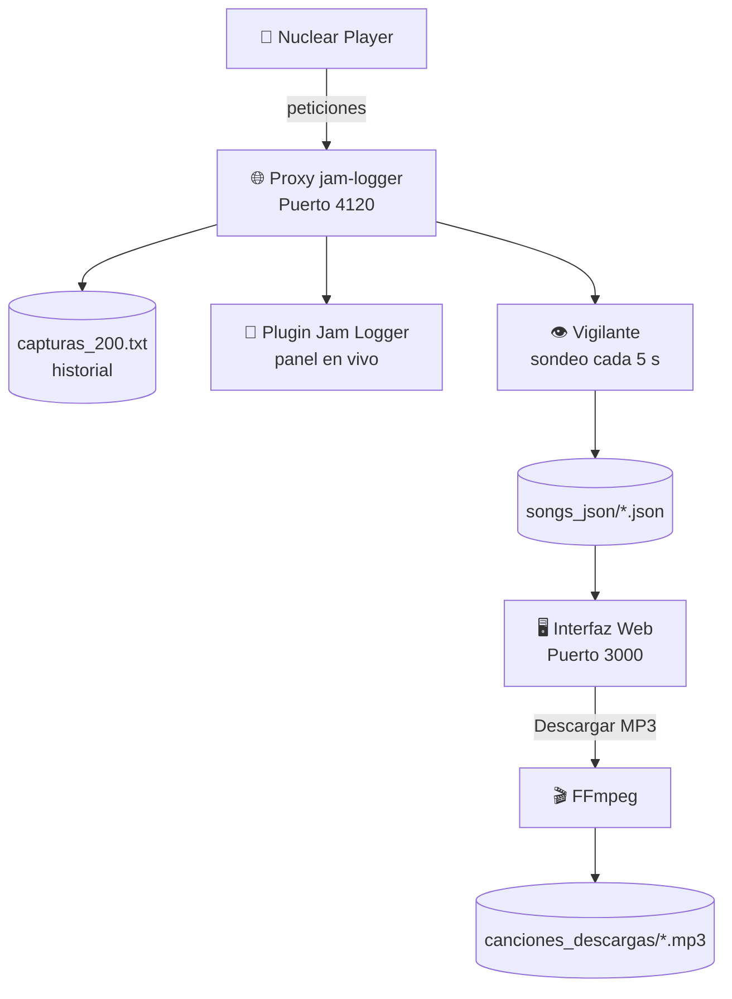

# 🎧 jam-logger

### Plugin + proxy de logs y descargas para el reproductor **Nuclear**


> **Escucha música en Nuclear, ve los logs en vivo y llévatela en MP3 con carátula y etiquetas ID3.**

**Jam** actúa como intermediario: el proxy intercepta el tráfico, registra las peticiones y las entrega al plugin dentro de Nuclear.

---

## 📑 Contenido

1. [Descripción general](#-descripción-general)
2. [Requisitos previos](#️-requisitos-previos)
3. [Estructura del proyecto](#-estructura-del-proyecto)
4. [Instalación del plugin para Nuclear](#-instalación-del-plugin-para-nuclear)
5. [Ejecución del sistema](#️-ejecución-del-sistema)
6. [Uso diario](#-uso-diario)
7. [Notas importantes](#️-notas-importantes)
8. [Solución de problemas](#-solución-de-problemas)
9. [Aviso legal y autoría](#️-aviso-legal-y-autoría)

---

## 📖 Descripción general

**jam-logger** es un sistema para el reproductor **Nuclear**. Combina:

| Módulo | Puerto | Función |
|:--|:--:|:--|
| 🌐 **Proxy (Jam intermediario)** | `4120` | Intercepta peticiones, guarda historial y expone `/__intercept/logs` y `/__intercept/clear` al plugin. |
| 👁️ **Vigilante autónomo** | — | Detecta cambios de canción cada **5 s**, extrae metadatos y enlaces de streaming y guarda JSON. |
| 🖥️ **Interfaz web** | `3000` | Modo oscuro: tarjetas de canciones y descarga MP3 (audio + carátula + ID3). |
| 🔌 **Plugin Nuclear** | — | Panel en vivo de peticiones dentro de Nuclear (filtro, expandir body, copiar a Logs). |

### 🔄 Flujo de trabajo


```mermaid
flowchart TD
    A["🎵 Nuclear Player"] -->|peticiones| B["🌐 Proxy jam-logger<br/>Puerto 4120"]
    B --> L[("capturas_200.txt<br/>historial")]
    B --> P["🔌 Plugin Jam Logger<br/>panel en vivo"]
    B --> C["👁️ Vigilante<br/>sondeo cada 5 s"]
    C --> D[("songs_json/*.json")]
    D --> E["🖥️ Interfaz Web<br/>Puerto 3000"]
    E -->|Descargar MP3| F["🎬 FFmpeg"]
    F --> G[("canciones_descargas/*.mp3")]
```

### ✨ Características

- ✅ Intercepción de peticiones con buffer en memoria + archivo de historial.
- ✅ Endpoints `/__intercept/logs` y `/__intercept/clear` listos para el plugin.
- ✅ Detección automática de cambios de canción (incluido el paso a «Audio Oficial»).
- ✅ Interfaz web en modo oscuro con tarjetas.
- ✅ MP3 final con carátula e ID3.
- ✅ Solo módulos nativos de Node.js (sin `npm install`).

---

## ⚙️ Requisitos previos

| Herramienta | Para qué sirve | Dónde obtenerla |
|:--|:--|:--|
| **Node.js** | Ejecutar el proxy y la UI | [nodejs.org](https://nodejs.org/) |
| **FFmpeg** | Crear el MP3 con carátula y etiquetas | `winget install ffmpeg` (o `Gyan.FFmpeg`) |

Verifica en una terminal nueva:

```cmd
node -v
ffmpeg -version
```

---

## 📁 Estructura del proyecto

```text
jam-logger/
├── package.json          # Manifest del plugin Nuclear
├── plugin.js             # Código del plugin (panel en vivo)
├── proxy.js              # Proxy + vigilante + interfaz web
├── LICENSE
├── README.md
├── capturas_200.txt      # Se genera al usar (historial)
├── songs_json/           # Se genera: JSON por canción
└── canciones_descargas/  # Se genera: MP3 listos
```

---

## 🔌 Instalación del plugin para Nuclear

1. Crea una carpeta (por ejemplo `jam-logger-plugin/`) con:
   - `package.json`
   - `plugin.js`
2. En Nuclear: carga el plugin desde esa carpeta (Plugin store / plugins locales según tu versión).
3. Activa **Jam Logger** y, si quieres, configura:
   - **URL del proxy**: `http://127.0.0.1:4120`
   - **Intervalo de consulta**: 1000 ms
   - **Copiar al visor de logs**: sí/no

---

## ▶️ Ejecución del sistema

1. Abre PowerShell o CMD en la carpeta del proyecto:

   ```cmd
   cd ruta\a\jam-logger
   ```

2. Arranca el proxy:

   ```cmd
   node proxy.js
   ```

Verás algo como:

```text
🚀 jam-logger proxy activo
   Interceptación : http://127.0.0.1:4120
   Destino        : http://127.0.0.1:8800
   Logs plugin    : GET  /__intercept/logs?since=N
                   POST /__intercept/clear
🖥️  Interfaz gráfica  : http://127.0.0.1:3000
```

Variables de entorno opcionales:

| Variable | Default | Descripción |
|:--|:--|:--|
| `LISTEN_PORT` | `4120` | Puerto del proxy |
| `TARGET_HOST` | `127.0.0.1` | Host al que se reenvía |
| `TARGET_PORT` | `8800` | Puerto destino (MCP de Nuclear) |
| `UI_PORT` | `3000` | Puerto de la interfaz web |

---

## 🎧 Uso diario

1. Abre el navegador en **http://127.0.0.1:3000**.
2. Abre **Nuclear** y reproduce música con normalidad.
3. El vigilante crea un `.json` en `songs_json/` al detectar canción nueva.
4. La interfaz se actualiza sola; pulsa **Descargar MP3**.
5. Dentro de Nuclear, el panel **Jam Logger** muestra las peticiones en vivo (si el proxy está corriendo).

---

## ⚠️ Notas importantes

> [!WARNING]
> **Caducidad de enlaces.** Los streams de CDN caducan. Descarga poco después de reproducir.

> [!IMPORTANT]
> **Puertos libres.** Comprueba que `4120` y `3000` no estén ocupados.

> [!NOTE]
> El proxy reenvía por defecto a `127.0.0.1:8800` (MCP de Nuclear). Si tu instancia usa otro puerto, define `TARGET_PORT`.

---

## 🩺 Solución de problemas

| Síntoma | Causa probable | Solución |
|:--|:--|:--|
| `'ffmpeg' no se reconoce...` | FFmpeg no está en el PATH | Reinicia la terminal o reinstala; verifica con `ffmpeg -version`. |
| Error al iniciar: puerto en uso | 4120 o 3000 ocupados | Cierra la otra instancia o libera el puerto. |
| La descarga falla | Enlace de streaming caducado | Vuelve a reproducir y descarga enseguida. |
| No aparecen tarjetas | Aún no hay canciones detectadas | Reproduce en Nuclear, espera y revisa `songs_json/`. |
| Plugin: «No se pudo consultar el proxy» | Proxy apagado o URL incorrecta | Arranca `node proxy.js` y revisa la URL en ajustes del plugin. |

### Liberar un puerto ocupado (Windows)

```cmd
netstat -ano | findstr :3000
taskkill /PID <PID> /F
```

Cambia `:3000` por `:4120` si hace falta.

---

## ⚖️ Aviso legal y autoría

Proyecto de **uso personal y educativo**. Descarga únicamente contenido que tengas derecho a guardar y respeta los derechos de autor y los términos de servicio de las plataformas involucradas.

- 👤 **Autor:** VicenteRC-Dev
- 📄 **Licencia:** MIT
- 🔗 Repositorio original (legado): [Downloader-Nuclear](https://github.com/VicenteRC-Dev/Downloader-Nuclear)

---

<p align="center"><b>jam-logger</b> · v0.2.0 · Hecho con ☕ por VicenteRC-Dev</p>
