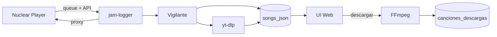

# 🎧 jam-logger

**Proxy + interfaz web + resolución de álbumes para [Nuclear Music Player](https://nuclear.js.org/)**

[](https://www.microsoft.com/windows)
[](https://nodejs.org/)
[](https://ffmpeg.org/)
[](https://github.com/yt-dlp/yt-dlp)
[](#)
[](#-changelog)
[](LICENSE)

> Escucha en Nuclear, captura álbumes completos, cambia fuentes de YouTube y descarga MP3 en alta calidad  
> con carátula, tags ID3 y número de pista — organizados por carpeta de álbum.

```bash
node proxy.js
# → http://127.0.0.1:3000
```

---

## Tabla de contenidos

- [Qué es](#qué-es)
- [Características](#características)
- [Flujo](#flujo)
- [Inicio rápido](#inicio-rápido)
- [Estructura del proyecto](#estructura-del-proyecto)
- [Uso diario](#uso-diario)
- [Interfaz web](#interfaz-web)
- [API](#api)
- [Solución de problemas](#solución-de-problemas)
- [Notas](#notas)
- [Changelog](#changelog)
- [Licencia y autoría](#licencia-y-autoría)

---

## Qué es

**jam-logger** es un único proceso Node.js que trabaja junto a Nuclear:

| Módulo | Función |
| --- | --- |
| Servidor unificado | Un puerto para UI, APIs y proxy hacia Nuclear |
| Vigilante | Cada 5 s lee la cola y guarda metadatos |
| Resolvedor de álbumes | Completa pistas con **yt-dlp** (YouTube) |
| Interfaz web | Biblioteca, reproductor y descargas |
| Interceptación | Logs para plugin / depuración |

Sin `npm install`. Solo **Node.js**, **FFmpeg** y **yt-dlp**.

---

## Características

### Captura y álbumes

- Vigilante automático cada **5 segundos**
- Álbum **nuevo** (≥ 2 pistas) → resuelve todas con yt-dlp
- Álbum **parcial** → pregunta en la web: todas / solo faltantes / omitir
- Un archivo JSON por canción en `songs_json/`

### Fuentes (yt-dlp)

- Búsqueda con filtros estrictos (artista + título)
- Evita lives, covers, karaoke, intros, etc.
- Botón **Regenerar fuentes** para streams caducados
- **Cambiar fuente** por canción (búsqueda o URL de YouTube)

### Descargas MP3

- Calidad **320 kbps** CBR + carátula embebida
- Tags ID3: título, artista, álbum y **número de pista**
- Carpetas por álbum: `canciones_descargas/<Álbum>/`
- Botón **✕** para cancelar una pista o el álbum entero

### Interfaz

- Temas: Spotify · Apple Music · Lite
- Crossfade, autoplay, velocidad y temporizador
- Acceso por LAN desde el móvil u otro PC
- Clic derecho en una pista → cambiar fuente / reproducir

---

## Flujo


```mermaid
flowchart LR
    A[Nuclear Player] -->|queue + API| B[jam-logger]
    B -->|proxy| A
    B --> C[Vigilante]
    C --> D[yt-dlp]
    C --> J[(songs_json)]
    D --> J
    J --> E[UI Web]
    E -->|descargar| F[FFmpeg]
    F --> M[(canciones_descargas)]
```

---

## Inicio rápido

### Requisitos

| Herramienta | Para qué | Cómo obtenerla |
| --- | --- | --- |
| **Node.js** ≥ 24 | Ejecutar el servidor | [nodejs.org](https://nodejs.org/) |
| **Nuclear** | Reproductor | [nuclearplayer.com/](https://nuclearplayer.com/) |
| **FFmpeg** | MP3 + carátula + ID3 | `winget install ffmpeg` |
| **yt-dlp** | Streams de YouTube | [Releases](https://github.com/yt-dlp/yt-dlp/releases) o en el PATH |

Comprueba en una terminal:

```cmd
node -v
ffmpeg -version
yt-dlp --version
```

### Instalación y arranque

```bash
git clone https://github.com/VicenteRC-Dev/jam-logger.git
cd jam-logger

# Opcional: coloca yt-dlp.exe (Windows) o yt-dlp en esta carpeta
node proxy.js
```

| Acceso | URL |
| --- | --- |
| Este equipo | http://127.0.0.1:3000 |
| Red local | http://\<IP-de-la-consola\>:3000 |

Al iniciar verás algo así:

```text
🚀 Jam Logger (Proxy + UI + Álbum Resolver)
📡 Puerto único:     http://127.0.0.1:3000
📡 Proxy → Nuclear:  127.0.0.1:4120
🌐 Interfaz LAN:     http://192.168.x.x:3000
```

### Variables de entorno

| Variable | Default | Descripción |
| --- | :---: | --- |
| `LISTEN_PORT` | `3000` | Puerto de UI + APIs + proxy |
| `TARGET_HOST` | `127.0.0.1` | Host de Nuclear |
| `TARGET_PORT` | `4120` | Puerto de la API de Nuclear |

```powershell
# PowerShell
$env:LISTEN_PORT=4121; node proxy.js
```

```bash
# Linux / macOS
LISTEN_PORT=4121 TARGET_PORT=4120 node proxy.js
```

---

## Estructura del proyecto

```text
jam-logger/
├── proxy.js                  # Servidor completo (un solo archivo)
├── README.md
├── LICENSE
├── yt-dlp.exe / yt-dlp       # requerido · descargas
├── public/                   # requerido · CSS/JS externos
├── package.json              # opcional · plugin Nuclear
├── plugin.js                 # opcional · panel en vivo
├── capturas_200.txt          # generado · historial
├── songs_json/               # generado · metadatos por canción
└── canciones_descargas/      # generado · MP3 por álbum
    └── Nombre del Álbum/
        ├── Pista 1.mp3
        └── Pista 2.mp3
```

Ejemplo de JSON en `songs_json/`:

```json
{
  "cancion": "NOCHES FRÍAS",
  "album": "LA ODISEA",
  "artista": "Jasiel Nuñez",
  "imagen": "https://i.scdn.co/image/ab67616d00001e029b7b01c383be069b94003e85",
  "stream_url": "https://rr4---sn-5hxgpj5hv8pa-jj2l.googlevideo.com/videoplayback?expire=1...",
  "orden": 1,
  "videoId": "yrav_hUNqB0",
  "from": "manual",
  "youtube": "https://www.youtube.com/watch?v=yrav_hUNqB0",
  "matchTitle": "Noches Frías- Jasiel Nuñez (Lyric Video)"
}
```

---

## Uso diario

1. Abre **Nuclear** y reproduce música.
2. Ejecuta `node proxy.js`.
3. Entra a **http://127.0.0.1:3000**.
4. Las canciones y álbumes aparecen solos.
5. Reproduce, descarga o cancela desde la web.

| Situación | Comportamiento |
| --- | --- |
| Canción suelta | Guarda JSON si no existía |
| Álbum nuevo | Resuelve todas las pistas con yt-dlp |
| Álbum parcial | Modal: actualizar todas · solo faltantes · omitir |
| Stream caducado | *Regenerar fuentes* o clic derecho → *Cambiar fuente* |
| Descarga en curso | Botón **✕** cancela (HTTP + FFmpeg) |

---

## Interfaz web

- **Inicio** — grid de álbumes (portada, artista, cantidad de pistas)
- **Detalle** — lista tipo Spotify, play y descarga por pista o álbum
- **Reproductor** — seek, volumen, crossfade y autoplay
- **Ajustes** — tema, velocidad, temporizador, atajos, UI compacta

**Descargas**

- Progreso circular por canción y por álbum
- Botón **✕** visible solo mientras descarga
- Archivo final: `canciones_descargas/<Álbum>/<Canción>.mp3`

**Plugin Nuclear (opcional)**

1. Carpeta con `package.json` y `plugin.js`
2. Cargar como plugin local en Nuclear
3. URL del proxy = mismo `LISTEN_PORT` (ej. `http://127.0.0.1:3000`)

---

## API

| Método | Ruta | Descripción |
| :---: | --- | --- |
| `GET` | `/` | Interfaz web |
| `GET` | `/api/songs` | Biblioteca (`hasMp3`, `mp3Rel`, metadatos) |
| `POST` | `/api/download` | Convertir / guardar una canción |
| `POST` | `/api/download-cancel` | `{ "archivo" }` o `{ "all": true }` |
| `GET` | `/api/progress?archivo=` | `{ porcentaje, estado, cancel }` |
| `GET` | `/api/album-pending` | Álbum parcial pendiente |
| `POST` | `/api/album-resolve` | `all` · `missing` · `skip` |
| `POST` | `/api/search-sources` | Buscar en YouTube |
| `POST` | `/api/change-source` | Asignar `videoId` / stream |
| `POST` | `/api/regenerate-sources` | Renovar todos los streams |
| `GET` | `/api/regenerate-progress` | Progreso de regeneración |
| `GET` | `/canciones/...` | Servir MP3 (incluye subcarpetas) |
| `GET` | `/__intercept/logs` | Logs para plugin |
| `POST` | `/__intercept/clear` | Limpiar logs |

El resto de rutas se reenvían a Nuclear (`TARGET_HOST:TARGET_PORT`).

---

## Solución de problemas

| Síntoma | Causa probable | Solución |
| --- | --- | --- |
| `ffmpeg` no se reconoce | Fuera del PATH | Reinicia la terminal o reinstala |
| yt-dlp no encontrado | Binario ausente | PATH o `yt-dlp.exe` junto a `proxy.js` |
| Puerto en uso | `LISTEN_PORT` ocupado | Cierra la otra instancia o cambia el puerto |
| Bad gateway / no captura | Nuclear apagado | Arranca Nuclear y revisa `TARGET_PORT` |
| Descarga sin audio | Stream caducado | Regenerar fuentes o cambiar fuente |
| No hay álbumes en la UI | Aún sin JSON | Reproduce unos segundos y recarga |
| *Circular structure to JSON* | Versión antigua | Usa **v0.3.0** o superior |
| Plugin no conecta | URL incorrecta | Mismo puerto que `LISTEN_PORT` |

Liberar un puerto en Windows:

```cmd
netstat -ano | findstr :3000
taskkill /PID <PID> /F
```

---

## Notas

> [!WARNING]
> Los streams de CDN **caducan**. Si la descarga falla, regenera fuentes o vuelve a reproducir la canción.

> [!IMPORTANT]
> Necesitas **yt-dlp** y **FFmpeg**. Sin ellos no hay resolución de álbum ni conversión a MP3.

> [!TIP]
> Desde el móvil (misma Wi‑Fi), abre la **IP LAN** que muestra la consola al arrancar.

---

## Changelog

### v0.3.0

- Tag ID3 **track** (número de pista)
- MP3 organizados en **carpetas por álbum**
- **Cancelar** descargas (pista o álbum completo)
- Resolvedor de álbumes + modal si el álbum está parcial
- Regenerar y cambiar fuentes
- Temas, crossfade, sleep timer y atajos de teclado
- Puerto único y corrección de serialización en el progreso

### v0.2.0

- Reproductor web en modo oscuro
- Separación por álbum (en desarrollo)
- Descargas desde el navegador y por LAN
- Icono de gato en el HTML

### v0.1.0

- Repositorio inicial
- Interceptación de tráfico y extracción de JSON
- Plugin con panel en vivo

---

## Licencia y autoría

Proyecto de **uso personal y educativo**.  
Creado por netamente aburrimiento y por una idea de un amigo.

- **Autor:** [VicenteRC-Dev](https://github.com/VicenteRC-Dev)
- **Licencia:** MIT
- **Proyecto legado:** [Downloader-Nuclear](https://github.com/VicenteRC-Dev/Downloader-Nuclear)

---

**jam-logger** · v0.3.0 · Hecho con 🎶 por VicenteRC-Dev
